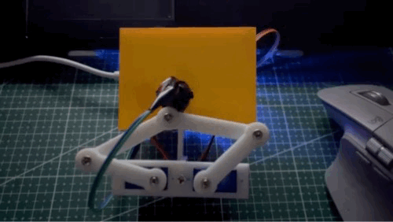
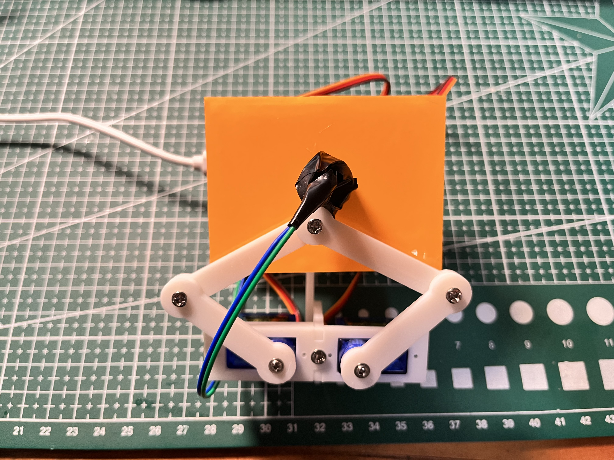
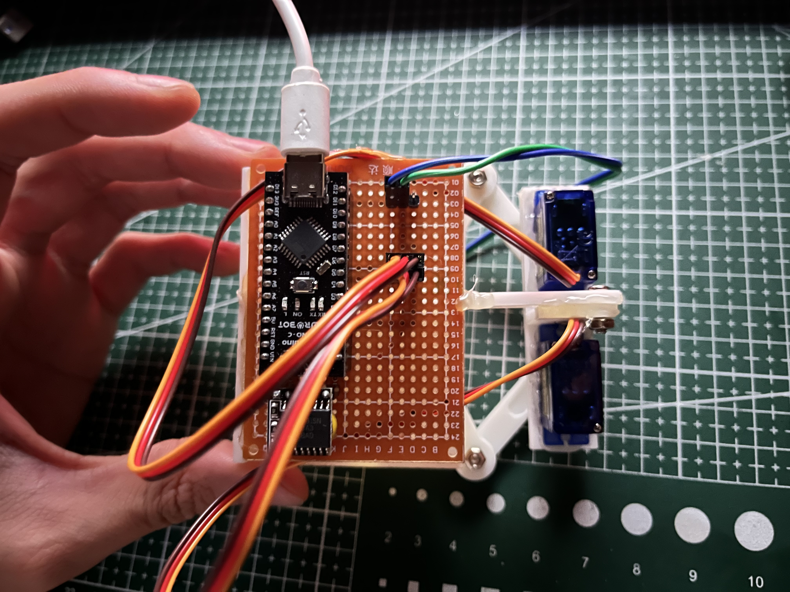
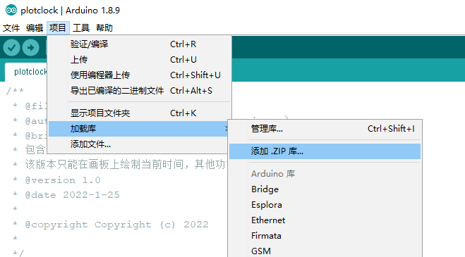
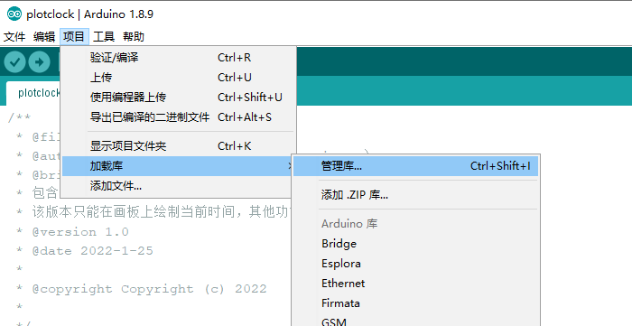
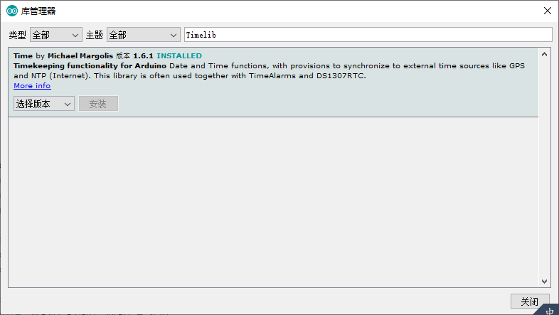

## 夜光“小贱钟” plotclock



区别于原版三舵机设计，采用紫外光代替传统油性笔，少了笔墨的香味，却多了不少迷人的光污染 : )


### 实现环境

- Arduino IDE
- Ardino Nano V3 核心板  * 1
- DS3231高精度时钟模块 * 1
- SG90舵机 * 2
- 紫外光发光二极管 * 1
- 夜光贴纸 10cm*15cm * 1
- 支架（3d打印）

成本 100 r 左右（相比某宝的原版便宜不少）


### 使用方法

#### 1、硬件组装

##### 舵机支架

舵机支架来自开源3d模型网站[thingiverse](https://www.thingiverse.com/thing:251911)，并去除其中多余的第三舵机部分，见model.stl文件

效果如下：




##### 硬件连线

- A5   <---------> DS3231的SCL
- A4   <---------> DS3231的SDA
- D6   <---------> 左舵机
- D5   <---------> 右舵机
- D12 <---------> LED

效果如下：




#### 2、导入相关库

##### DS3231.h

在Arduino IDE中，选择项目-加载库-添加zip，加入项目中的 ==DS3231.zip== 文件进行安装。

**库函数默认 A4 对应 DS3231 的 SDA ，A5 对应 DS3231 的 SCL**



（原库函数链接[ http://www.rinkydinkelectronics.com/library.php?id=74 ]( http://www.rinkydinkelectronics.com/library.php?id=74 )）**有做一定修改，增加了部分类内函数。**


##### Timelib.h

在Arduino IDE中，选择项目-加载库-管理库



在库管理器中搜索Timelib，安装跳出的第一个库




#### 3、运行代码

打开==plotclock.ino==，根据注释调整相关模型参数，初次使用请开启调试模式，即去掉 `ADJUST` 的注释进行舵机臂位置的调试，去掉 `GPIO` 进行发光二极管的调试。

```c++
#define normal_mode     // 开启正常模式
//#define ADJUST        // 开启调试模式
//#define GPIO          // 开启调试模式
//#define extra_mode    // 开启额外模式
```

